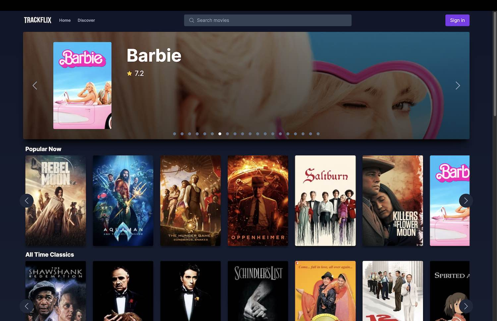
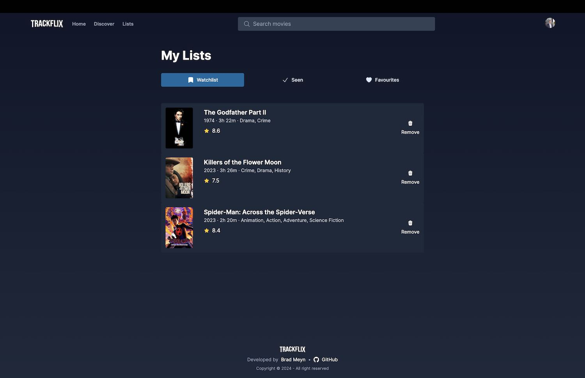
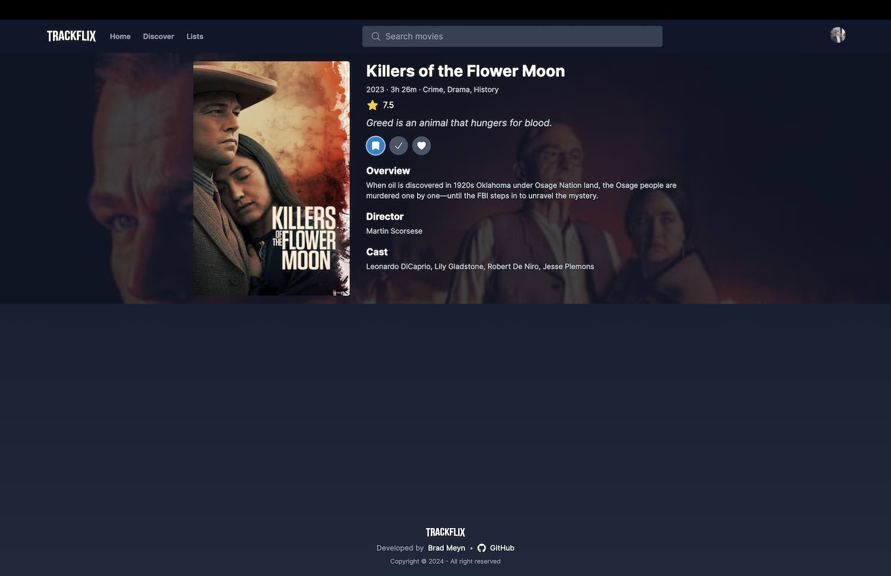
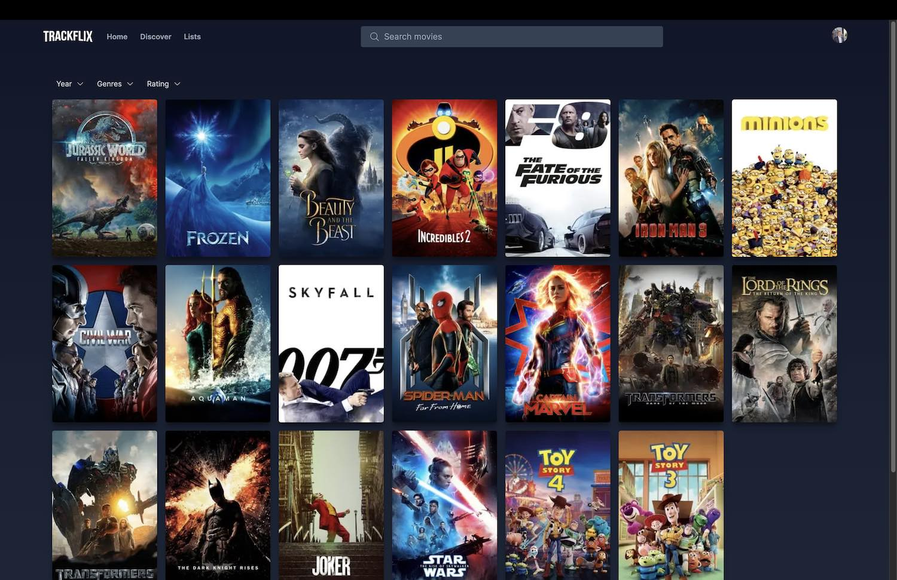

# Trackflix

## Fullstack Movie Tracking App

### Description

Trackflix is a fullstack web application that allows users to search for movies and save them to various lists. I built it as a way to learn Next.js & NextAuth.

### Features:

- Browse, filter, search and sort movies, using the TMDB API
- Create an account with Github
- Save movies to a watchlist, favourites or seen lists

### Key Technologies:

- Next.js 14 with React Server Components
- Tailwind CSS
- TMDB API

## Screenshots

### Home Page

### Lists Page

### Movie Page

### Discover Page

